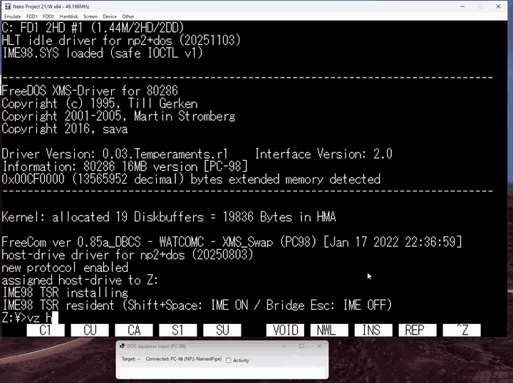

# PC98IMEBridge — PC-98 日本語入力ブリッジ

PC98IMEBridgeは、Windows IMEで確定した日本語をnp21w上のPC-98アプリへ送る
ためのツールです。Windows側の入力ウィンドウと、FreeDOS(98)側の常駐
プログラムで動作します。

PC-98側の `IME98TSR.COM` は、起動後もメモリに残り、ホットキーの検出と
Bridgeとの通信を行う常駐プログラムです。この形式をTSR（Terminate and
Stay Resident）と呼びます。以降、本書ではこの常駐プログラムを「TSR」
と表記します。

現在確認済みの環境は、Windows x64、np21w rev103、FreeDOS(98)です。
実機PC-98およびNEC MS-DOSでの動作は未確認です。

## 動作デモ

[](docs/assets/PC98IMEBridge-demo.mp4)

画像をクリックするとMP4動画を開きます。

## 必要なもの

- Windows 10または11（x64）
- .NET 8 Windows Desktop Runtime（x64）
- np21w rev103
- FreeDOS(98)の起動環境
- PC-98側から参照できるnp21wの共有フォルダー（以下では `Z:`）

np21wとFreeDOS(98)は配布ZIPに含まれません。

## インストール

バイナリ配布ZIPを展開し、`pc98` フォルダーの次のファイルをnp21wの
共有フォルダーへコピーします。

```text
IME98TSR.COM
IME98.CFG
AUTOEXEC.BAT
```

付属の `AUTOEXEC.BAT` は、共有フォルダーがPC-98側の `Z:` に見える
前提です。別のドライブになる場合はパスを変更してください。

通常利用ではCONFIG.SYSへの `DEVICE` 行の追加は不要です。

## np21wの設定

np21wの **Device > Serial/Parallel option...** を開き、**COM1** を次の
ように設定します。

```text
Port:        PIPE
Pipe Name:   NP2-NamedPipe
Server Name: .
Speed:       19200 bps
```

COM3やFIFOモードは使用しません。Pipe Nameには
`\\.\pipe\NP2-NamedPipe` ではなく、`NP2-NamedPipe` だけを入力します。

## 起動と使い方

1. np21wより先に、Windows側で次を実行します。

   ```text
   windows\ImeDosBridge.exe --pipe NP2-NamedPipe --pipe-client
   ```

2. np21wでFreeDOS(98)を起動します。
3. 起動時に次のような表示が1回だけ出ることを確認します。

   ```text
   IME98 TSR resident (Shift+Space: IME ON / Bridge Esc: IME OFF)
   ```

4. PC-98側でShift+Spaceを押すと、Windows側の入力欄が開きます。
5. 日本語または英数字を入力し、EnterでPC-98へ送信します。
6. 入力欄が空のときにEscを押すとIMEがOFFになり、np21wへ戻ります。

入力欄が空のときは、Enter、Backspace、上下左右キーもPC-98へ送信
できます。

## 設定の変更

- `pc98\IME98.CFG`: COM1とPC-98側ホットキーの設定
- `windows\IMEBRIDGE.CFG`: Windows側ショートカットの設定

PC-98側ホットキーは `SHIFT+SPACE`、`CTRL+SPACE`、`GRAPH+SPACE` から
選べます。設定を変更した場合は、対応するプログラムを再起動してください。

Named Pipe名を変更する場合は、np21wとBridgeの両方を同じ名前にします。

```text
np21w COM1 Pipe Name: PC98IMEBridge-PC98
ImeDosBridge.exe --pipe PC98IMEBridge-PC98 --pipe-client
```

## 更新と削除

更新するときはBridgeとnp21wを終了し、配布ファイルを置き換えてから
FreeDOS(98)を再起動してください。すでに常駐しているTSRの上から新しい
TSRを常駐させないでください。

再起動せずに解除する場合は `IME98TSR.COM /U` を実行します。TSRが使用
する割り込みを直接所有していることを確認してから、通信を停止し、割り込み
設定と常駐メモリを元に戻します。`memory released` と表示された後は再度
常駐できます。安全確認に失敗した場合は解除されないため、FreeDOS(98)を
再起動してください。

## 困ったとき

- **Bridgeが接続待ちのまま:** COM1、PIPE、Pipe Name、Server Nameを確認し、
  Bridgeを先に起動してからnp21wを再起動してください。
- **Shift+Spaceが反応しない:** `IME98TSR.COM` が起動時に1回だけ常駐し、
  `IME98.CFG` に `HOTKEY=SHIFT+SPACE` があることを確認してください。
- **文字が届かない:** PC-98側アプリがCP932（Shift-JIS）入力に対応して
  いることと、Bridgeが `Ready for input` を表示していることを確認して
  ください。
- **動作履歴を確認したい:** Bridgeの `Activity` を有効にしてください。
  同じ内容が実行ファイル横の `bridge-status.log` に保存されます。

詳しい技術情報、ビルド手順、検証記録は [`docs/`](docs/) を参照して
ください。現在の仕様は [`SPECIFICATION.md`](SPECIFICATION.md) にあります。

## ライセンス

PC98IMEBridgeは
[GNU General Public License v3.0 or later](LICENSE)（`GPL-3.0-or-later`）
で公開されています。
